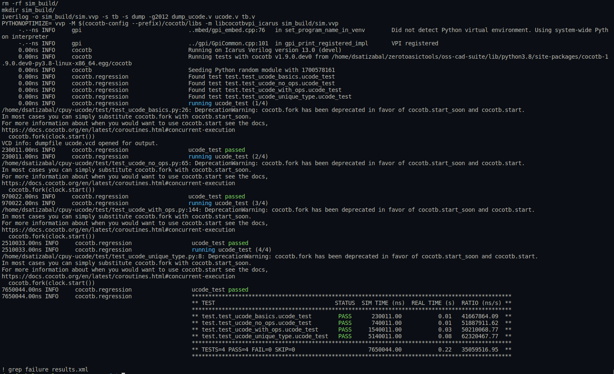
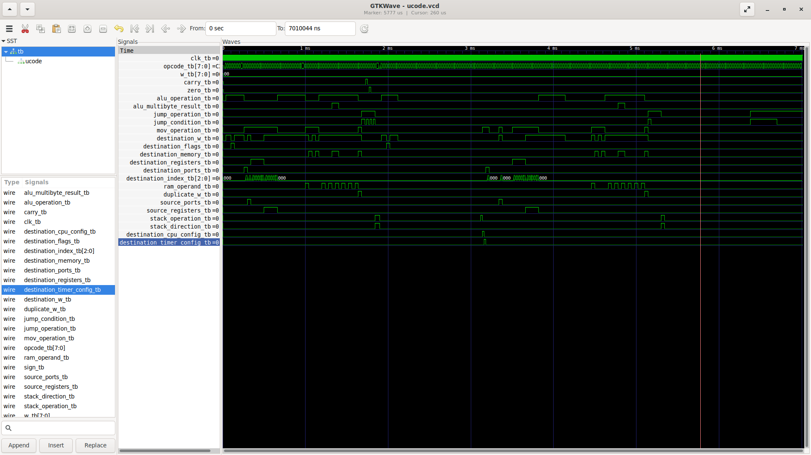

# Microcode for CPU implementation

Implements the microcode that can be used for a CPU implementation, intended to be used in a simple 8-bits CPU to be sent for Tapeout in the [Dec 2023 Efabless shuttle](https://efabless.com/gf-180-open-mpw-shuttle-program)

## Inputs and Outputs description:

- **clk**:  input of CPU clock
- **opcode**: Opcode of the current operation (without any pre processing)
- **w**: Value of Work register
- **carry**: Value of CPU carry flag
- **zero**:  Value of CPU zero flag
- **alu_operation**: Indicates if the current operation is performed in the ALU
- **alu_multibyte_result**: Indicates if the ALU output is 2-bytes (Multiplication)
- **jump_operation**: Indicates if operation is a jump
- **jump_condition**: Indicates if condition to jump is satisfied
- **mov_operation**: Indicates if operation is a movement
- **destination_w**: Indicates if destination of operation goes to Work register
- **destination_flags**: Indicates if destination of operation goes to CPU flags
- **destination_memory**: Indicates if destination of operation goes to memory
- **destination_registers**:  Indicates if destination of operation goes to General Purpose registers
- **destination_ports**:  Indicates if destination of operation goes to ports

## Operation:

The microcode is active all the time, no enable signal is avaibale, on evety clock cycle the outputs will change according to the conditions given by the input values. The idea behind this is for the CPU to use the output signals as indication on how to perform actions during the instructions execution phase, a previous fectch phase to get opcode and operands must exist, maybe some later phases can be required.

**Observe** that, as per 19 Nov 2023, all possible combinations of Opcodes are declared but not used this is likely to be removed, some other (particularly the ones starting by 1 in the MSB) have duplicate opcodes, this is because the LSB is used to indicate the number of operands that these instructions must fetch, in some cases this is not required and likely opcodes can be reused in the future.

## Synthetizing with YoSys:

Run:

```
make synth_ucode
```

and you should see a YoSys window opening showing the synthesis like this (kind of complex this one :S):


observe this synth does not use standard cells, not much details is appreciated in the image but with yosys on yoyr computer you can see it is a huge multiplexer.

## Running CocoTB tests:

Type the following command to run tests:

```
make test_ucode
```

you should see a result like this:



Observe in the Makefile that a dump_ucode.v file is included and used to run the test command, in that file, the output file and the variables to be dumped (the name of the top module) are defined, after running the test the corresponding .vcd (value change dump) file is created and you can proceed to view it with the GtkWave command:

```
make gtkwave_ucode
```

a GtkWave window will open, you should see the hierarchy of the TestBechn and ALU containing the available signals that can be displayed for examination, like in our case we're viewing the clk, opcode, work register value, carry flag, zero flag and all outputs of the uCode:



observe that for tests we're using a verilog testbench defined in the tb.v file (Design Under Test or DUT for CocoTB) that instantiates the ALU module and assings the corresponding signals.

## Running Formal Verification:

WIP
